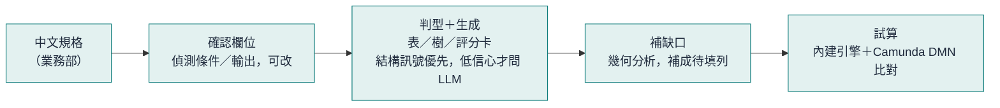
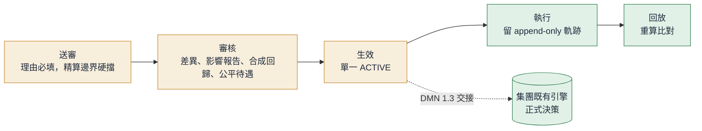
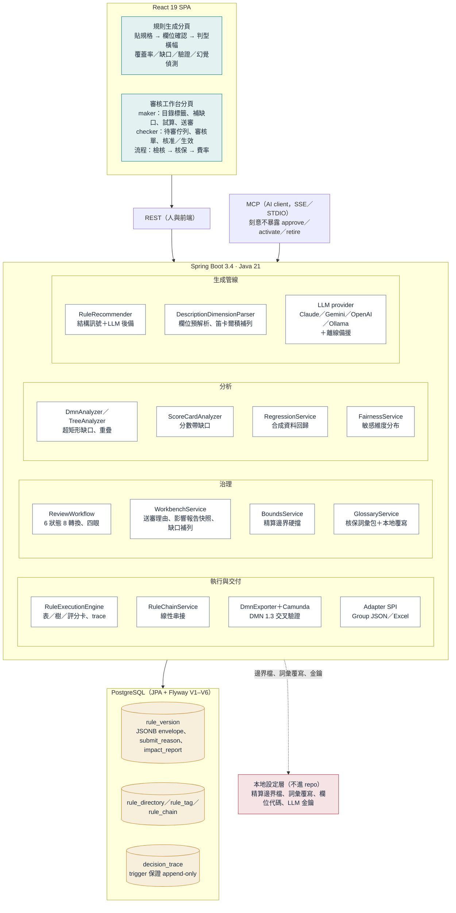
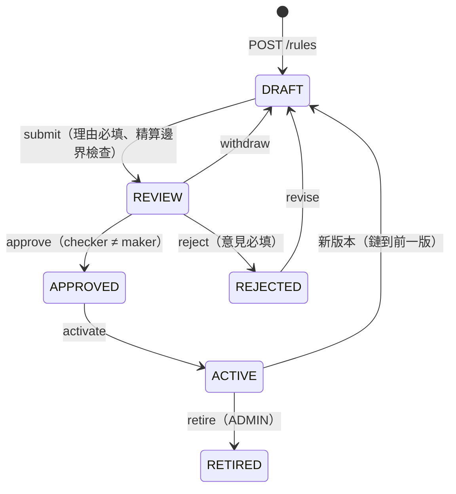

# Intelligent Rule Engine

**保險業務部的規則工作台** — 把業務人員寫的中文核保規格，變成可審核、可驗證、可回放的規則；正式執行交給既有引擎。

*English: a rule workbench for insurance business teams. Chinese underwriting spec → field confirmation → decision table / tree / scorecard → gap analysis → maker-checker review with impact report, synthetic regression and actuarial bounds → DMN export cross-checked against an open-source engine → trace & replay. Exposed to AI clients over MCP with the approval boundary deliberately kept out of the tool surface.*

金融業實習作品，源自規則治理的實際問題。Spring Boot 3.4 · Java 21 · Spring AI MCP · PostgreSQL · Camunda DMN · React 19

---

## 為什麼做這個

一家壽險公司的核保規則（年齡、病史、職業 → 承保／加費／除外／延期／拒保）通常由精算或 IT 維護，業務部只能「提需求、等排程」。這帶來四個痛：

| 痛點 | 現場長什麼樣 | 根因 |
|---|---|---|
| **改一條規則要等幾週** | 業務部用 Word 寫需求 → 排精算 → 排 IT → 等版本；精算被日常維護綁住，做不了真正的精算工作 | 規則的「寫、審、驗」都要技術人員介入 |
| **中文規格翻成規則靠人** | 像「無症狀/輕症：(1)未痊癒 → 延期；(2)已痊癒：A.無後遺症 → 標準體…」這種大綱，由人翻成表，漏組合、互相打架沒人發現 | 規則存在文件裡，不存在結構裡 |
| **改了不知道影響多大** | 審核主管看到的是一段文字描述，簽的是信任不是證據；哪些組合沒覆蓋、幾件案子結果會變，上線前說不清 | 沒有上線前的分析與回歸 |
| **出事回不去** | 客訴或金檢問「這件為什麼拒保」，只能翻舊文件和 log，無法重算證明當時判得對 | 執行沒有留可回放的軌跡 |

## 定位：風洞，不是引擎

上線前，業務部自己寫、自己驗：



治理與執行，主管看證據、執行留軌跡、正式決策交給既有引擎：



- **業務部自己寫、自己審、自己驗**：制單人（業務同仁）貼規格、補缺口、試算、送審；審核人（業務主管）看差異、影響報告、合成資料回歸後核准、生效。
- **精算只設邊界**：保費係數上限、哪些年齡帶不得自動承保，寫在精算維護的邊界檔；業務規則送審時逐列檢查，越界直接擋下並升級給精算。
- **正式執行留給既有引擎**：內建 `RuleExecutionEngine` 只做上線前模擬與回歸；規則以標準 DMN 1.3 交接，並用嵌入的 Camunda DMN 引擎跑同一組輸入證明結果一致。

## 系統架構



規則版本的生命週期（送審人不得審自己的案子；同一 `ruleKey` 只能有一個 ACTIVE）：



四條主線：

1. **生成管線**：描述 ≥ 120 字先偵測欄位讓使用者確認；型態判定以規格結構（多層編號、縮排、列舉維度、逐條檢核）為主，信心不足才請 LLM 二選一，仍判不出就反問一題。LLM 產出經正規化、笛卡爾積補齊組合（漏的標待填）、11 個錯誤碼驗證。
2. **分析**：規則表轉成超矩形，純符號找缺口與重疊（不靠 LLM）；缺口可一鍵補成待填的規則列。送審時合成案件跑新舊版，列出結果改變的案子。
3. **治理**：DRAFT → REVIEW → APPROVED → ACTIVE → RETIRED，退回可修訂；送審人不得審自己的案子；送審理由與影響報告在送審當下快照落庫，事後不漂移；精算邊界越界即擋。
4. **執行與交付**：內建引擎執行生效版並寫入不可竄改的 `decision_trace`，可回放重算；規則匯出標準 DMN，嵌入 Camunda 引擎交叉驗證；也可匯出集團風格樹 JSON／Excel 給既有系統。

## 與通用規則引擎的差別

| | 通用引擎（DecisionRules、Rulebricks 等） | 這個專案 |
|---|---|---|
| 賣什麼 | 執行：表格編輯器、低延遲 API | 上線前：寫對、審對、驗對 |
| 規則怎麼來 | 人在編輯器一列一列填；AI 最多幫建欄位 | 整段中文規格直接出整張表／樹，自動補組合 |
| 品質怎麼保證 | 人工測試案例 | 幾何缺口／重疊、合成資料回歸、精算邊界硬擋、Camunda 交叉驗證 |
| 懂不懂保險 | string／number | 核保詞彙包：承保／加費／除外／延期／拒保／人工評估、保費係數、職業類別、失能等級、敏感維度 |
| 審核 | 版本、RBAC | 四眼原則、送審理由、影響報告、不可竄改軌跡；AI 不能核准 |
| 執行 | 自家引擎是核心 | 內建引擎只模擬；正式執行交既有引擎，用 DMN 交接 |

## 保險專屬能力

- **核保詞彙包**（`glossary/underwriting-vocabulary.yaml`）：決議值、人工評估、保費係數、除外、延期、職業類別、失能等級、敏感維度、檢核訊息，各帶 `semantic` 語意角色；公司自己的欄位代碼與值域放本地覆寫檔（`RULES_GLOSSARY_OVERRIDE`），同 id 覆蓋，不進 repo。
- **精算邊界**（`bounds/bounds-sample.yml` 為合成示範，`RULES_BOUNDS_FILE` 指向真實檔）：輸出上下限（保費係數 ≤ 2.2）與禁止組合（66 歲以上不得自動承保）；影響報告顯示檢查結果，送審越界回 `422 BOUNDS_VIOLATION`。
- **檢核清單**：多重命中的決策表（身分證／國籍、通路／授權書這類「若…則拋訊息」規則）以清單呈現，各自獨立、不做缺口分析。
- **線性串接**：檢核 → 核保 → 費率，前一步輸出變下一步輸入，檢核命中即中斷。
- **合成資料回歸**：由欄位型別與兩版規則的邊界值合成案件，不碰任何真實資料。

## 功能總覽（目前可用）

| 分頁 | 功能 |
|---|---|
| 規則生成 | 整段規格輸入、欄位確認（第 1 步／2）、型態判定橫幅（信心、一句理由、一鍵改型）、反問對話框、覆蓋率／缺口／重疊、驗證、幻覺偵測、信心分數、What-If、表↔樹轉換、匯出 |
| 審核工作台（maker） | 新增規則、樹狀目錄＋兩維標籤、白話句子／表格／縮排大綱／樹圖／檢核清單檢視、缺口「補成案例」、中文描述請 AI 提修改建議（只提案不儲存）、前後對照、試算（含 Camunda DMN 比對、下載 .dmn）、精算邊界、送審（理由必填） |
| 審核工作台（checker） | 待審佇列、審核單（送審人、理由、精算邊界、合成資料回歸、缺口／重疊快照、結構與行為比對、差異）、試算、核准／退回（意見必填）、設為生效 |
| 流程 | 建立有序步驟、命中即中斷、試跑看每步命中與最終輸出 |
| 執行 | 生效版執行留軌跡編號，可回放重算比對 |

## API 對照

| 階段 | 端點 | 角色 |
|---|---|---|
| 偵測欄位 / 判型 / 生成 / 驗證 / 分析 | `POST /tools/suggest` · `/recommend` · `/generate` · `/validate` · `/analyze` | 任何人 |
| 存為草稿 / 目錄與標籤 | `POST /rules` · `GET /rules/tree` · `PUT /rules/{key}/placement` | MAKER |
| 缺口補列 / AI 修改建議 | `POST /rules/{id}/gap-case` · `/suggest-change` | MAKER |
| 送審（理由必填，邊界檢查） / 撤回 / 修訂 | `POST /rules/{id}/submit` · `/withdraw` · `/revise` | MAKER |
| 審核單 | `GET /rules/{id}/review-sheet`（差異、缺口、精算邊界、合成回歸） | 登入者 |
| 核准 / 退回 / 生效 / 退役 | `POST /rules/{id}/approve` · `/reject` · `/activate` · `/retire` | CHECKER（≠ 送審人）／ADMIN |
| 流程 | `GET/PUT /rules/chains/{key}` · `POST /engine/chain/{key}/execute` | MAKER／登入者 |
| 模擬 / 執行 / 回放 | `POST /tools/execute`（不留軌跡）· `POST /engine/execute` · `/engine/replay/{traceId}` · `GET /engine/traces` | 登入者 |
| DMN | `POST /tools/dmn/export` · `/export.xml` · `/check`（內建引擎 vs Camunda） | 任何人 |
| 詞彙 | `GET /tools/glossary?semantic=manual-review` | 任何人 |

規則狀態共 6 種、8 條合法轉換；同一個 `ruleKey` 同時只能有一個 ACTIVE 版本（資料庫 partial unique index 保證）。

## 快速開始

需要 JDK 21、Maven 3.9、Docker（跑 PostgreSQL）。

```bash
# 1. 起 PostgreSQL（對外 5433）
docker compose up -d postgres

# 2. 啟動服務（Flyway 會自動建表）
export SPRING_DATASOURCE_URL=jdbc:postgresql://localhost:5433/rules
mvn spring-boot:run
# → http://localhost:8080   Swagger UI: /swagger-ui.html
```

```bash
# 3. 登入（開發用 demo 帳號：maker / checker / admin，密碼見 application.yml）
curl -s localhost:8080/auth/login -H 'Content-Type: application/json' \
  -d '{"username":"maker","password":"demo-pass-2026"}'
```

沒有 LLM 金鑰也能跑：預設 provider 是本機 Ollama，不可用時自動退回離線情境。要接雲端模型，設 `CLAUDE_API_KEY`／`GEMINI_API_KEY`／`OPENAI_API_KEY`。

本地專用設定（都不進 repo）：`RULES_BOUNDS_FILE` 精算邊界檔、`RULES_GLOSSARY_OVERRIDE` 詞彙覆寫檔。正式環境務必關閉 demo 帳號、設定 `RULES_JWT_SECRET`（`application-prod.yml` 已預設 `enforce`）。

前端：`./build-frontend.ps1` 會把 React SPA 打包進 jar；開發模式見 `frontend-src/`（Vite 代理 `/tools` `/rules` `/engine` `/auth` 到 8088）。

```bash
mvn test        # 單元 + 整合（含 Camunda 交叉驗證）；Testcontainers 的 PostgreSQL migration 測試在無 Docker 時自動跳過
```

## 與 MCP 的關係

MCP 在這裡是**給 AI 用的介面**，不是系統本身。同一套能力有兩個入口：REST（給人與前端）、MCP（給 Claude 等 AI client，SSE 與 STDIO 皆可）。

- 13 個 tool：生成、驗證、分析、型態推薦、轉換、樹優化、輸入完整度檢查、批次測試…
- 7 個 resource：server 資訊、範例、response schema
- **刻意不暴露**：approve / activate / retire。AI 可以幫你把規則寫好、查出缺口，但不能自己放行。

STDIO 設定（Claude Desktop）：

```json
{ "mcpServers": { "rules": {
    "command": "java",
    "args": ["-jar", "target/rules-mcp-server-1.0.0-SNAPSHOT.jar", "--spring.profiles.active=stdio"] } } }
```

## 效能

單機實測（開發用筆電、JDK 21；JMH 1 fork、3 暖身＋5 量測；負載為 H2 記憶體庫＋`mvn spring-boot:run`，數字只供量級參考）。

| 項目 | 數字 | 怎麼量 |
|---|---|---|
| 單次執行：決策表 FIRST，最壞情況（最後一列才命中） | 10 列 0.8 μs · 100 列 3.0 μs · 500 列 7.5 μs | JMH `ExecutionBenchmark.tableFirstWorstCase` |
| 單次執行：開 SUMMARY 軌跡 | 比不開多 0.1–0.2 μs | JMH `ExecutionBenchmark.tableWithSummaryTrace` |
| 單次執行：理賠示範樹（5 層）／評分卡（3 維度） | 0.7 μs／0.5 μs | JMH `ExecutionBenchmark.tree` · `.scoreCard` |
| 重疊偵測，1000 條規則 | 1320 ms → 7.1 ms（185x） | JMH `OverlapDetectorBenchmark`，掃描線剪枝 |
| `POST /tools/execute`，16 併發 10 秒 | p50 8.9 ms · p95 13.4 ms · p99 23.9 ms · 1,667 rps · 0 錯誤 | `node load.mjs`（含 HTTP、JSON 序列化） |
| `POST /tools/analyze`（缺口／重疊），8 併發 | p50 7.5 ms · p95 9.7 ms · 1,061 rps | 同上 |
| `POST /tools/recommend`（選型，純結構訊號） | p50 9.3 ms · p95 12.3 ms | 同上 |
| `/generate` 併發時的 `/health` | 6987 ms → 126 ms | LLM 長請求改走專用有界池（DeferredResult），滿載回 429 |
| Camunda DMN 交叉驗證 | 首次約 500 ms（FEEL 暖機），之後 ms 級 | 試算面板顯示 |

生成耗時由 LLM 決定（本地 7B 模型一張表數十秒到兩分鐘），要在目標機器實測。

重現：
```powershell
mvn test-compile
mvn dependency:build-classpath "-Dmdep.outputFile=target\cp.txt" "-Dmdep.includeScope=test"
java -cp "target\classes;target	est-classes;$(Get-Content target\cp.txt -Raw)" com.ruleengine.rules.bench.ExecutionBenchmark
```

## 現況與限制

| 項目 | 狀態 |
|---|---|
| DecisionTable、DecisionTree | 生成、驗證、分析、轉換、執行、diff、DMN 匯出、Camunda 交叉驗證 |
| ScoreCard | 可選型、生成、驗證、執行、分數帶缺口/重疊分析、工作台檢視與試算；表↔評分卡轉換與 DMN 匯出未做 |
| 執行引擎 | 直譯式，用於模擬與回歸；與生產引擎的差異透過 adapter SPI（`MockGroupEngine` 為示範）與 DMN 交接 |
| 公平待遇分析、法規標籤 | 審核單顯示敏感維度的結果分布與閾值警示；「法規」為標籤維度，顯示於審核單 |
| LLM 選型後備、AI 修改建議 | 需要本地 Ollama 模型或雲端金鑰才會真的呼叫模型；沒有時走規則與離線備援 |
| MCP | 只有 tool 與 resource；尚無 prompt template，也還沒有「建草稿／送審」tool |

## 文件

- [CHANGELOG](./CHANGELOG.md) · [版本演進](./docs/version-history.md)
- [RuleEnvelope 格式、錯誤碼、Operator](./docs/rule-envelope-reference.md)
- [專案結構](./docs/project-structure.md)
- [DecisionTree v2 優化設計](./docs/decision-tree-v2.md)
- [雲端部署藍圖](./docs/deployment-architecture.md) · [部署手冊](./docs/deployment-playbook.md) · [`k8s/`](./k8s/)
- [`design/`](./design/)：各子系統設計筆記
